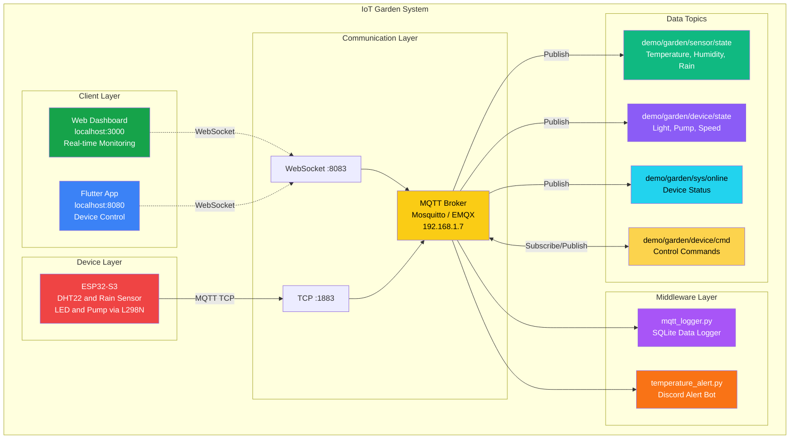
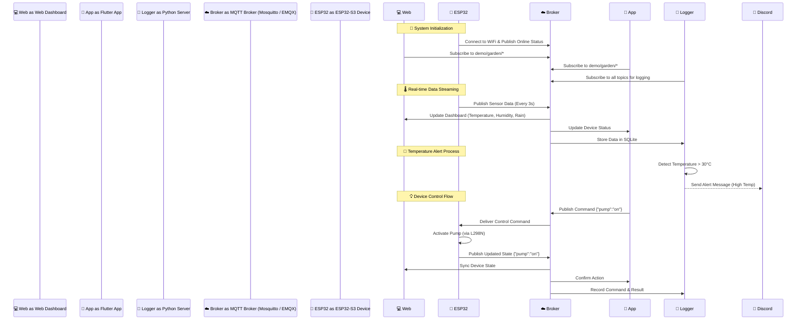
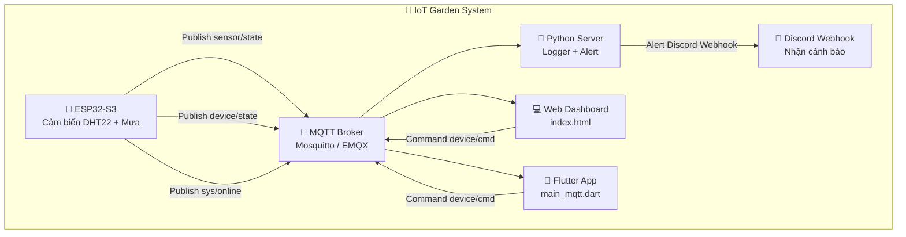

# 🌿 **IoT Garden System – Smart Agriculture Monitoring**

<div align="center">


**📡 Hệ thống IoT vườn thông minh – Giám sát & điều khiển theo thời gian thực**  
**ESP32-S3 + DHT22 + Cảm biến mưa + Máy bơm RS385 + LED + MQTT Broker + Web/App Flutter**

</div>

---

## 📋 **Tổng quan hệ thống**

Dự án **IoT Garden** giúp người dùng **giám sát nhiệt độ, độ ẩm, và lượng mưa**, đồng thời **điều khiển máy bơm và đèn chiếu sáng** từ xa thông qua **MQTT**.  
Toàn bộ dữ liệu được **ghi log bằng Python**, **cảnh báo qua Discord**, và **hiển thị thời gian thực** trên **Web Dashboard và App Flutter**.

---

## ⚙️ **Thành phần hệ thống**

| Thành phần | Mô tả | Công nghệ |
|-------------|-------|------------|
| **Thiết bị nhúng (ESP32-S3)** | Đọc dữ liệu cảm biến và điều khiển thiết bị (LED, Bơm) | C++ / Arduino |
| **MQTT Broker** | Trung gian giao tiếp (Publish / Subscribe) | Mosquitto / EMQX |
| **Middleware (Python)** | Lưu log và cảnh báo | Python 3.11, `paho-mqtt`, `requests` |
| **Giao diện Web** | Giám sát thời gian thực | HTML / CSS / JavaScript / MQTT.js |
| **Ứng dụng Flutter** | Điều khiển thiết bị từ điện thoại | Flutter 3.22 + Provider |
| **CSDL cục bộ** | Lưu dữ liệu cảm biến và trạng thái thiết bị | SQLite |

---

## 🎯 **System Architecture**

### 🏗️ **Overall System Diagram**



### � **Data Flow Architecture**



## 🔗 **Cấu trúc thư mục**

```
📦 iot_garden_project/
│
├── 🌐 web/                          # Web Dashboard
│   ├── src/
│   │   └── index.html              # Giao diện giám sát MQTT (WebSocket)
│   └── README.md
│
├── 📱 app_flutter/                  # Flutter Mobile App (Controller)
│   ├── lib/
│   │   ├── main.dart               # Flutter entry point
│   │   ├── main_mqtt.dart          # MQTT client app (TCP)
│   │   ├── main_mqtt_web.dart      # MQTT client app (WebSocket)
│   │   └── main_simple.dart        # Phiên bản rút gọn (demo)
│   └── README.md
│
├── 🤖 firmware_esp32s3/             # ESP32-S3 Firmware (C++)
│   ├── src/
│   │   └── main.cpp                # Chương trình chính cho ESP32-S3
│   └── README.md
│
├── 🐍 alerts/                       # Python Alert Services
│   ├── temperature_alert.py        # Cảnh báo nhiệt độ qua Discord
│   └── README.md
│
├── 🐍 database/                     # Python Data Logging
│   ├── mqtt_logger.py              # Ghi dữ liệu MQTT vào SQLite
│   ├── view_database.py            # Truy vấn dữ liệu cảm biến
│   ├── iot_garden_data.db          # CSDL chính của hệ thống
│   └── README.md
│
├── 🔧 infra/                        # Hạ tầng MQTT Broker
│   ├── README.md
│   └── mosquitto.conf              # Cấu hình Mosquitto local broker
│
└── readme_iot_garden.md            # README chính của đồ án
```

---

## 🧠 **Kiến trúc hoạt động**



---

## 🧩 **Các thành phần phần mềm**

### 🌐 **Web Dashboard (`index.html`)**
- Hiển thị:
  - 🌡️ Nhiệt độ, 💧 Độ ẩm, ☁️ Trạng thái mưa  
  - 💡 LED và 💦 Bơm (bật/tắt)
  - 📶 Cường độ tín hiệu WiFi, trạng thái Online
- Gửi lệnh MQTT:
  ```javascript
  client.publish("demo/garden/device/cmd", '{"pump":"toggle"}');
  ```

---

### 📱 **Flutter App (`main_mqtt.dart`)**
- Kết nối MQTT qua `mqtt_client`
- Giao diện điều khiển 2 thiết bị:
  - **LED**
  - **Bơm tưới**
- Đồng bộ thời gian thực với Web:
  ```dart
  client.publishMessage(
    "demo/garden/device/cmd",
    MqttQos.atLeastOnce,
    utf8.encode(jsonEncode({"light":"toggle"}))
  );
  ```

---

### 🤖 **Firmware ESP32-S3 (`main.cpp`)**
- Đọc cảm biến DHT22 và mưa mỗi **3s**
- Gửi dữ liệu MQTT:
  - `demo/garden/sensor/state`
  - `demo/garden/device/state`
- Nhận lệnh điều khiển từ topic `device/cmd`  
- Tự động reconnect WiFi & MQTT

---

### 🐍 **Python Server**
#### `mqtt_logger.py`
- Lắng nghe tất cả các topic trong `demo/garden/*`
- Ghi dữ liệu vào `iot_garden_data.db`
- Lưu lại lịch sử cảm biến và trạng thái thiết bị

#### `temperature_alert.py`
- Theo dõi `sensor/state`
- Nếu nhiệt độ > 30°C, gửi cảnh báo 🔴 lên Discord
- Khi bình thường lại → gửi thông báo xanh ✅

---

## 📡 **Cấu trúc Topic MQTT**

```
demo/garden/
├── sensor/state     → {"temperature":31.5,"humidity":80,"is_raining":false}
├── device/state     → {"light":"toggle","pump":"off","pumpSpeed":80}
├── device/cmd       → {"pump":"on"} hoặc {"light":"toggle"}
└── sys/online       → {"online":true,"deviceId":"esp32s3_garden"}
```

---

## ⚙️ **Cấu hình và chạy thử**

### 1️⃣ **Khởi động MQTT Broker**
```bash
# Cài đặt Mosquitto (Windows hoặc Ubuntu)
mosquitto -c infra/mosquitto.conf
```

### 2️⃣ **Chạy Python Logger và Alert**
```bash
cd python_server
python mqtt_logger.py
python temperature_alert.py
```

### 3️⃣ **Mở Web Dashboard**
```bash
cd web_dashboard
python -m http.server 3000
# Truy cập: http://localhost:3000
```

### 4️⃣ **Chạy Flutter App**
```bash
cd app_flutter
flutter run -d chrome
```

### 5️⃣ **Kết nối ESP32-S3**
- Cấu hình trong `main.cpp`:
  ```cpp
  const char* WIFI_SSID = "Le Thanh Vu";
  const char* WIFI_PASS = "Nam180504@@";
  const char* MQTT_HOST = "192.168.1.7";
  const char* TOPIC_NS  = "demo/garden";
  ```
- Nạp chương trình qua Arduino IDE hoặc PlatformIO  
- Quan sát Serial Monitor để xem log dữ liệu gửi/nhận.

---

## 💾 **CSDL `iot_garden_data.db`**
| Bảng | Chức năng | Trường dữ liệu chính |
|------|------------|-----------------------|
| `sensor_data` | Lưu dữ liệu cảm biến | temperature, humidity, rain_analog, is_raining |
| `device_state` | Trạng thái thiết bị | light, pump, pumpSpeed, rssi |
| `device_online` | Theo dõi trạng thái thiết bị | online, firmware, device_id |
| `commands` | Lưu các lệnh điều khiển | command_type, command_value, source |

---

## 🧪 **Kiểm thử nhanh**

```bash
# Xem dữ liệu MQTT
mosquitto_sub -h 192.168.1.7 -t "demo/garden/#" -v

# Gửi lệnh bật bơm
mosquitto_pub -h 192.168.1.7 -t "demo/garden/device/cmd" -m '{"pump":"on"}'
```

**Kết quả mong đợi:**
- ESP32-S3 bật bơm thật  
- Web Dashboard và App Flutter hiển thị trạng thái “Pump: ON”  
- Logger lưu bản ghi mới trong SQLite

---

## 📈 **Ưu điểm thiết kế**
- Hệ thống **thời gian thực – phản hồi tức thì**
- Tự động **khôi phục kết nối WiFi/MQTT**
- Có **ghi log, cảnh báo và dashboard trực quan**
- Mở rộng dễ dàng (thêm cảm biến hoặc thiết bị mới)

---

## 🧑‍💻 **Thông tin dự án**

- **Sinh viên:** Nhóm 
- **Trường:** Trường Đại học Thủ Dầu Một (TDMU)  
- **Môn học:** Thực hành IoT & Ứng dụng  
- **Đề tài:** Hệ thống vườn thông minh (Smart Garden IoT)  
- **Năm học:** 2025  

---

<div align="center">

**🌿 Made with ❤️ for IoT Education at TDMU**

</div>

